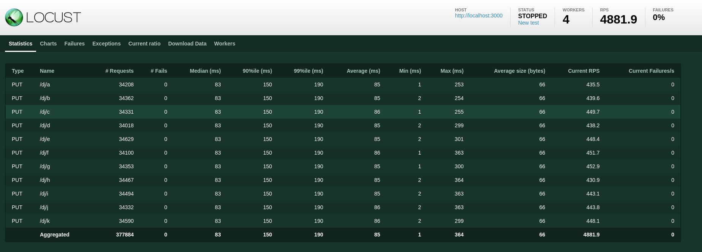

# ts-letscount
Typescript Version of Let's Count. It's an API that counts things. Potentially lots of different things, concurrently and/or in parallel. This is not production-ready. It is barely even software. 

Let's Count is my version of "hello world" for learning about new languages and frameworks. It always has at least three endpoints, is wired up to an RDBMS (sqlite counts), and exposes an API I can profile with [locust](https://locust.io/) and test with [hurl](https://hurl.dev). Sometimes I get fancy and try to figure out things like idempotency keys or user permissions, sometimes I don't. The goal of Let's Count is to be a "narrow, deep slice" through an entire ecosystem. I want to at least trivially exercise all the basic components  - json serialization, input validation, testing, routing, db libraries, concurrency, parallelism, etc. I want something I can implement in less than a day in any language, that will give me a general feel for the maturity and capabilities of the system I'm using. 

Endpoints: 

##### PUT /:namespace/:counter
Increment the `counter` in `namespace`. If the counter doesn't exist, create it and set the value to 1. If the namespace doesn't exist, create it. Return the value of the count after the increment.

##### GET /:namespace/:counter
Get the value of the `counter` in `namespace`.

##### GET /:namespace
Get the values of all `counters` in `namespace`.

#### Locust results with 500 concurrent writers (using better-sqlite3, which blocks the main thread)

